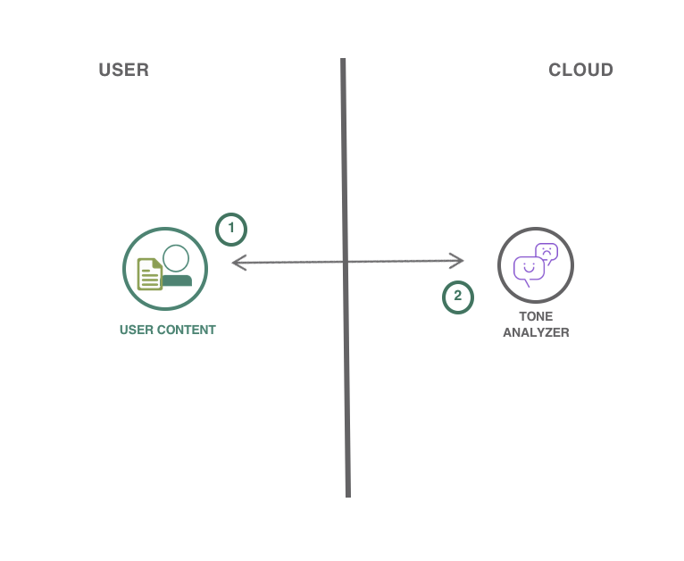
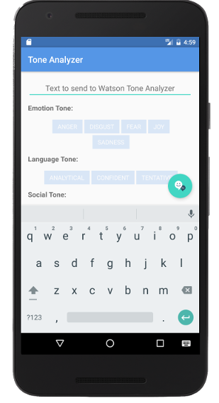
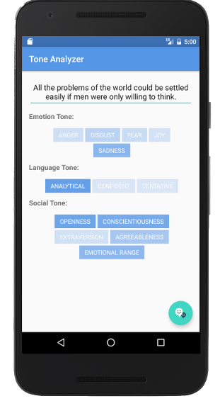

# Create an Android application in Java which analyzes the emotion and tone of natural language

> We have a similar pattern available for [iOS](https://github.com/IBM/tone-analyzer-ios), as well!

In this code pattern, you will create an Android application using the Watson Tone Analyzer service. You will be able to analyze emotions and tones in what people write online, such as in tweets or reviews, and then predict whether they are happy, sad, confident, and more. Monitor customer service and support conversations so you can respond to your customers appropriately and at scale. Enable your chatbot to detect customer tones so you can build dialog strategies to adjust the conversation accordingly.

When you have completed this code pattern, you will understand how to:

* Build a mobile application that uses Watson Tone Analyzer
* Provision and integrate additional IBM Cloud services
* Learn how to analyze emotions and tones in text

## Steps

> As an alternative to the steps below, you can [create this project as a starter kit](https://cloud.ibm.com/developer/mobile/create-app?defaultDeploymentToolchain=&defaultLanguage=ANDROID&env_id=ibm%3Ayp%3Aus-south&starterKit=a16f3f49-3f8c-37eb-a848-c56d3fb47197&tenantNavMode=true) on IBM Cloud, which automatically provisions required services, and injects service credentials into a custom fork of this pattern. Then, you can skip directly to step 3 below.

1. [Install development tools](#1-install-development-tools)
2. [Create a Tone Analyzer service instance](#2-create-a-tone-analyzer-service-instance)
3. [Run](#3-run)

### 1. Install development tools

Ensure you have the latest version of [Android Studio](https://developer.android.com/studio/) installed.

### 2. Create a Tone Analyzer service instance

Use the [IBM Cloud Catalog](https://cloud.ibm.com/catalog/) to [create a Tone Analyzer service instance](https://cloud.ibm.com/catalog/services/tone-analyzer) on the Lite plan. Make sure to select **Use both legacy credentials and IAM** to receive the proper credential set for the Cloudant SDK.

When the service has been created, navigate to the **Service credentials** tab, and create a **New credential ⊕** with the default options. Click **View credentials**. Edit `app/src/main/res/values/credentials.xml` in your project to configure your application with your Cloudant credentials.

### 3. Run

* You can now build and run the application from Android Studio!

 

The application allows you to use the Watson Tone Analyzer service to analyze text. Tone Analyzer leverages cognitive linguistic analysis to identify a variety of tones at both the sentence and document level. This insight can then used to refine and improve communications.

Enter text in the input text box and then click the Tone Analyzer button to see the results. The results will be shown under each category after the text has been analyzed. The tag visibility will change based on the percentage returned from Watson, but you can click on tag directly to see the exact percentage.

## License

This code pattern is licensed under the Apache License, Version 2. Separate third-party code objects invoked within this code pattern are licensed by their respective providers pursuant to their own separate licenses. Contributions are subject to the [Developer Certificate of Origin, Version 1.1](https://developercertificate.org/) and the [Apache License, Version 2](https://www.apache.org/licenses/LICENSE-2.0.txt).

[Apache License FAQ](https://www.apache.org/foundation/license-faq.html#WhatDoesItMEAN)
